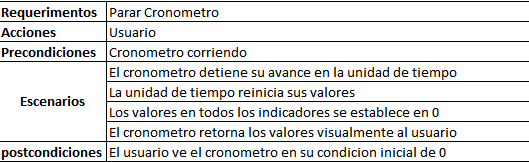
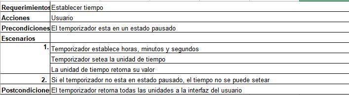
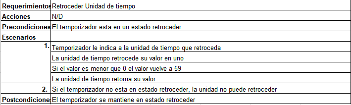

# Cronometro-Temporizador
Desarrollo de un cronometro básico con interfaz gráfica utilizando Java

## Participantes
Luis Daniel Hormiga González 20172020026  
Javier Andrés Aponte Quevedo 20172020036  
Julian David Rincon Castro 20172020125  

## Diagnóstico de planificación y estimación de un cronómetro en java
1. **Ámbito del software y Factibilidad.**  
  - **Contexto:** El software de un cronometro y un temporizador pueden ser utilizados en varios contextos, ya sean deportivos, o de entrenamiento, o para limitar distintas actividades.  
  - **Objetivos de información:** El cronómetro y temporizador necesita del usuario simplemente dos acciones (o datos) los cuales deben ser el de iniciar/detener el cronómetro, o establecer tiempo en caso del temporizador.  
  - **Función y rendimiento:** El software del cronómetro utiliza librerías de java cuyas funciones son el manejo del tiempo, más específicamente la función de timer en java, su consumo de recursos es bajo y por lo tanto tiene un rendimiento rápido y eficaz.  

2. **Actividades Asociadas**  
| Función | Rendimiento | Restricciones |  
| ---- | ---- | ---- |  
| Reiniciar cronómetro | Inmediato | A selección del usuario |  
| Iniciar Cronómetro | Inmediato | Desde 0:00 |  
| Detener Cronómetro | Inmediato | A selección del usuario |  
| Establecer Temporizador | ne | A selección del usuario |  

3. **Estimación de uso de recursos.**  
  - Se espera que la mayoría de recursos se utilicen en el momento de relacionar la interfaz con el código del programa.
  - Se espera que el producto (cronómetro) utilice únicamente un tiempo de trabajo de aproximadamente 2 horas, teniendo en cuenta el uso de librería timer.
  - Se espera que la interfaz del programa utilice un tiempo aproximado de 1 hora, teniendo en cuenta la variedad de ventanas y botones que se utilizaran.
  - Se espera que el temporizador, al ser una variación del cronómetro con restricciones distintas no tome más de 1 hora.
  - El tiempo total de producción del programa aproximado es de 5 horas.
  
4. **Asignación de actividades**
  - Luis Hormiga: Creación de clases Menu y Tiempo.  
     - Clase Tiempo: 
      - Atributos: int segundos, int minutos, int hora.
      - Metodos: Tiempo(int seg, int min, int hora), Tiempo(), void avanzarTiempo(), void retrocederTiempo(), getSegundos(), setSegundos, getMinutos(), setMinutos(), getHora(), setHora.
     - Clase Menu:
      - Atributos: jbtnCronometro, jbtnTemporizador.
      - Metodos: Menu(), void jbtnCronometroActionPerformed(java.awt.event.ActionEvent evt), void jbtnTemporizadorActionPerformed(java.awt.event.ActionEvent evt).
       
  - Javier Aponte: Creación de clase Crono. 
    - Clase Crono: 
     - Atributos: Tiempo miTiempo, Timer time
     - Metodos: Crono(), void iniciarBotonActionPerformed(java.awt.event.ActionEvent evt), void pausarBotonActionPerformed(java.awt.event.ActionEvent evt),  void marcaBotonActionPerformed(java.awt.event.ActionEvent evt), void atrasBotonActionPerformed(java.awt.event.ActionEvent evt).
       
  - Julian Rincon: Creación clase Tempo.
    - Clase Tempo:
     - Atributos: Timer time, Tiempo miTiempo
     - Metodos: Tempo(), void BHBotonActionPerformed(java.awt.event.ActionEvent evt), void SMBotonActionPerformed(java.awt.event.ActionEvent evt), void BmBotonActionPerformed(java.awt.event.ActionEvent evt), void SSBotonActionPerformed(java.awt.event.ActionEvent evt), void BSBotonActionPerformed(java.awt.event.ActionEvent evt),  void iniciarBotonActionPerformed(java.awt.event.ActionEvent evt), void pausarBotonActionPerformed(java.awt.event.ActionEvent evt), void cancelarBotonActionPerformed(java.awt.event.ActionEvent evt), void atrasBotonActionPerformed(java.awt.event.ActionEvent evt).
     
## Diagramas

### Casos de uso

### Requerimientos

### Cronometro

#### Parar

#### Guardar

### Temporizador

#### Establecer tiempo

#### Establecer unidad tiempo

#### Establecer unidad seteada

#### Pausar

#### Parar

#### Reiniciar

#### Retroceder

#### Retroceder unidad de tiempo

### Clases

### Actividades

### Cronometro
#### Iniciar

#### Parar

#### Pausar

#### Guardar

### Temporizador
#### Iniciar temporizado

#### Establecer tiempo

#### Pausar

#### Parar/Reiniciar

### Secuencia

### Cronometro
#### Iniciar

#### Parar

#### Pausar

#### Guardar

### Temporizador

#### Establecer tiempo

#### Establecer unidad de tiempo

#### Retroceder Temporizador

#### Retroceder unidad de tiempo

#### Pausar

#### Parar/ Reiniciar

